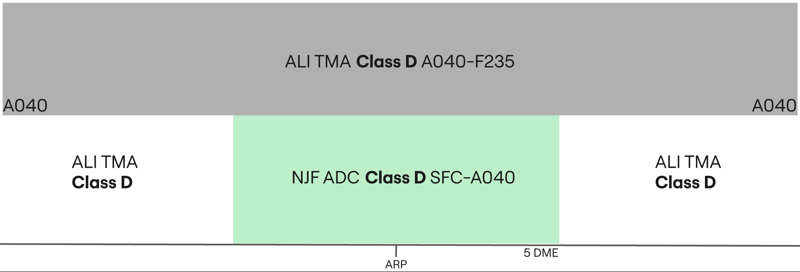

--8<-- "includes/abbreviations.md"

## Positions

|    Name   | Callsign	| Frequency | Login ID | Remarks |
| --------- | --------	| ---------	| -------- | ------- |
| **Al-Najaf ADC** | **Al-Najaf Tower** | **119.100** | **ORNI_TWR** | |
| **Al-Najaf SMC** | **Al-Najaf Ground** | **121.700** | **ORNI_GND**	| |
| **Al-Najaf ATIS** | | **123.900** | **ORNI_ATIS** | |

## Airspace - Class D

ORNI_TWR is responsible for the AL-Najaf CTR airspace from `SFC` to `A040`.

## VFR Operations
All VFR clearances are assigned by the revelant TWR controller.

### Circuits
VFR Circuits are permitted on runways **10** and **28**.

All VFR aircraft wishing to do remain in the circuit at Al-Najaf shall be issued not above `A040` and the following circuit directions:

| Runway | Direction |
| ------ | --------- |
|   10   | Right |
|   28   | Left |

!!! phraseology
    **ABC**: AL-Najaf Tower, ABC holding short D runway 10, fully ready.   
    **NJF ADC**: ABC, Al-Najaf Tower, cleared to operate in the circuit area not above altitude 4000ft, right hand circuits report on the downwind, surface winds 320 degrees 5 knots, cleared for take-off runway 10.  
    **ABC**: Cleared to operate in the circuit area not above altitude 4000ft, will report on the right downwind, cleared for take-off runway 10, ABC.

VFR Circuits shall **not** be permitted at the aerodrome during times of increased IFR departure or arrival activity.

### Leaving the CTR
Once VFR aircraft are ready for departure, they shall be cleared for take-off in sequence. As they begin their crosswind turn they shall be instructed to report leaving the CTR. VFR procedures inside the Al-Najaf CTR must be conducted at or below `A040`.

!!! phraseology
    **FYI**: Al-Najaf Tower, FYI holding short D runway 10.  
    **NJF ADC**: FYI, Al-Najaf Tower, surface winds 320 degrees 5 knots, cleared for take-off runway 10.  
    **FYI**: Roger, cleared for take-off runway 10.  
    **AIRCRAFT ON THE CROSSWIND TURN**  
    **NJF ADC**: FYI, report leaving the Al-Najaf CTR, maintain at or below altitude 4000ft.  
    **FYI**: At or below 4000ft, wilco, FYI.

Aircraft requesting to exit the Al-Najaf CTR shall be assigned a clearance limit followed by a valid VFR cruising altitude (+500ft).

!!! phraseology
    **YYC**: Al-Najaf Tower, YYC is requesting to exit the Al-Najaf CTR via direct Baghdad, altitude 5500ft.  
    **NJF ADC**: YYC, Al-Najaf Tower, cleared to leave the Al-Najaf CTR direct Baghdad, maintain altitude 5500ft, squawk 7403, QNH 998 hectopascals.  
    **YYC**: Cleared to leave the Al-Najaf CTR direct Baghdad, maintain altitude 5500ft, QNH 998, and squawk 7403, YYC.

### Entering the CTR
Inbound VFR aircraft shall be sent to **ADC** with enough time such that two-way
radio communications have been established before aircraft receive clearance to enter the CTR.

On initial contact, Al-Najaf **ADC** will pass the instructions for joining the circuit, as well as any other pertinent information such as traffic information with the sector.

!!! phraseology
    **YYC**: Al-Najaf Tower, YYC is requesting to enter the Al-Najaf CTR from the south for circuits.     
    **NJF ADC**: YYC, Al-Najaf Tower, information A, cleared to enter the Al-Najaf CTR, maintain at or below altitude 4000ft, report left downwind runway 28 with intentions, squawk 7403.  
    **YYC**: We have A, cleared to enter the Al-Najaf CTR, at or below altitude 4000ft, will report left downwind runway 28 with intentions, squawk 7403, YYC.   
    **NJF ADC**: YYC, correct, QNH 998 hectopascals.    

During times of heavy IFR arrival activity, VFR arrivals may be denied entry into the CTR and instructed to hold outside of the CTR awaiting further instructions.

## IFR Operations
IFR clearances are issued by Al-Najaf **SMC**, ensuring appropriate routing.

### Standard Instrument Departures (SIDs)
All aircraft shall be assigned a Standard Instrument Departure 

Controllers shall assign the proper SID exit waypoint based on the first enroute waypoint in their
flight plan, and the proper procedure identifier based on the selected runway for departure.
All SIDs with an identifier of 1A and 1C are valid for runway 10. SIDs with an identifier of 1B are valid for runway 28. 
Listed below are the SIDs:

|   SID   | 10 | 28 |
| ------- | -- | -- |
|  SIGBI  | 1A | 1B |   
|  ILMAP  | 1A | 1B | 
|  LAGLO  | 1A | 1B |  
|  NOLDO  |1A/1C| 1B|
|  SEPTU  | 1A | 1B |

Departures should primarily adhere to the Standard Instrument Departure (SID) routes, avoiding
radar vectors whenever feasible. If radar vectors are to be assigned, a specific reason must be
provided. 

#### Published SID Initial Climb Altitudes
The initial climb clearance is stated on published SID charts and does not need to be read to the pilot by
default. Nevertheless, if the pilot asks for the initial climb altitude, the controller shall advise them of the
following initial climb clearances:

|   SID   | Runway | Initial Climb Clearance |
| -------- | ------ | ------ |
| SIGBI 1A |   10   | 6000ft |   
| ILMAP 1B |   28   | 6000ft | 
| LAGLO 1A |   10   |10000ft |  
| NOLDO 1A |   10   |10000ft |
| SEPTU 1A |   10   |10000ft |
| NOLDO 1C |   10   |11000ft |
| ILMAP 1A |   10   |14000ft |
| LAGLO 1B |   28   |14000ft |
| NOLDO 1B |   28   |14000ft |
| SEPTU 1B |   28   |14000ft |
| SIGBI 1B |   28   |14000ft |

!!! phraseology
    **IAW123**: Al-Najaf Ground, IAW123, request clearance to Dubai, with information Alpha.  
    **NJF SMC**: IAW123, Al-Najaf Ground, cleared to Dubai, SEPT1A departure, flight planned route, squawk 4301. 

### Omni-directional Departures
Aircraft may be assigned an omni-directional departure if they are unable to fly a SID (for examble not RNAV capable), or for departures to the southwest, filing via RUKAM (or ALI DCT RUKAM). Al-Najaf **SMC** is required to adjust their phraseology for a omni-directional departure. 

!!! phraseology
    **IAW123**: Al-Najaf Ground, IAW123, request clearance to Dubai, unable SID, with information Alpha.  
    **NJF SMC**: IAW123, Al-Najaf Ground, cleared to Dubai, expect radar vectors to ILMAP after departure, flight planned route, squawk 4301. 

### Arrivals
At Al-Najaf, **ORNI_TWR** is responsible for the entirety of the CTR, and is required to provide top-down service if the underlying **SMC** controller is offline.

!!! phraseology
    **IAW123**: Al-Najaf Tower, IAW123, final runway 28.
    **NJF ADC**: IAW123, Al-Najaf Tower, salam, winds 260 degrees at 8 knots, runway 28 cleared to land.  

## Standard Taxi Routes
All departing aircraft shall be assigned the most appropriate taxiway, onto taxiway C. Al-Najaf **SMC** must exercise extreme caution on taxiway C, as conflicts can easily occur between arriving and departing traffic.

## Runway Modes
### Preferred Runway Modes
Winds must always be considered for Runway modes (Crosswind <20kts, Tailwind <5kts), however the order of preference is as follows:

| Priority - Mode | Arrivals | Departures | Remarks |
| --------------- | -------- | ---------- | ------- |
| 1 - MODE A | 28 | 10 | |
| 2 - MODE B | 10 | 28 | |
| 3 - MODE C | 28 | 28 | |
| 4 - MODE D | 10 | 10 | |

!!! warning    
    This preferential runway configuration applies opposite runway direction operations. This may not always be possible either due to weather conditions (specifically when there is a tailwind component greater than 5 knots) or due to volumes of high traffic, which make opposite direction operations unsuitable. The operating air traffic control officer shall use their discretion and take the above factors into account when deciding and implementing active runways for arrivals and departures.

## Coordination

### Departure Procedures
Due to the airspace structure in Al-Najaf, all departures shall be coordinated and receive a release for departure with the relevant Baghdad **TMA** controller.

'Next' coordination is required to the following stations, in the following scenarios:

| Coordination Station (ORNI_TWR -> ORXX_APP)| Departing Procedure|
| -------- | ----- |
| ORBI_APP | All SIDs **except** ILMAP departures, omni-directional departures expected to enter Baghdad TMA (mainly departures to the north) |
| ORNI_APP/ORMM_APP | ILMAP departures and all other omni-directional departures|

!!! note  
    ORNI_APP/ORMM_APP must be notified of aircraft that are being released on an omni-directional departure to ORBI_APP.

'Next' coordination is additionally required for:

- Visual depatures (eg. VFR aircraft)
- After a go around, the next departure from that runway

The Standard Assignable level from Al-Najaf **ADC** to Baghdad **TMA** is:

| Aircraft | Level |
| -------- | ----- |
| IFR | `A080` |
| VFR | `A050` |

!!! warning
    'Next' coordination **is mandatory** for **all** aircraft departing Al-Najaf.  

!!! phraseology
    **NJF ADC** -> **BI TMA**: "IAW123 for release, SIGBI1A departure, any problems?"  
    **BI TMA** -> **NJF ADC**: "IAW123 released, SIGBI1A departure, all is good"  

### Standard Assignable Departure Headings
If a departing aircraft is receiving an omni-directional departure, they must recieve an assigned heading with their line up or take-off clearance. Al-Najaf **ADC** controller shall coordinate with the overlying TMA controller on a heading to follow after departure, prior to issuing a takeoff clearance. Unless coordinated otherwise **ADC** shall assign the following heading for departing aircraft

| Runway | Heading |
| ------ | ------- |
| 10 | `H160` |
| 28 | `H330` |

!!! tip
    If strong winds are present at altitude, **ADC/TMA** should discuss slight changes to these headings (+/- 5 degrees) to compensate for large crosswind components.

!!! warning
    The runway heading `H100`/`H280` shall be avoided when possible.

!!! warning "Holy Shrine P102"  
    Special consideration must be given to a prohibited area west of the airport, when runway 28 is in use for departures. This prohibited area protects the “Holy Shrine” and flights shall, when possible and when not following SIDs, avoid the area by flying north of the Holy Shrine. VFR flights shall also be guided to avoid this area when possible.

!!! phraseology
    **IAW23**: IAW23 ready for departure.  
    **NJF ADC**: IAW23, after departure climb to altitude 4000ft, fly heading 160 degrees, surface winds variable at 3 knots, runway 10 cleared for take-off.

