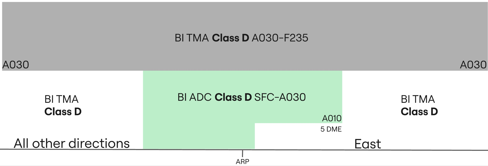

--8<-- "includes/abbreviations.md"

## Positions

| Name | Callsign | Frequency | Login ID | Remarks |
| ---- | -------- | ---------	| -------- | ------- |
| **Baghdad ADC**	| **Baghdad Tower** | **118.900**	| **ORBI_TWR**	| |
| **Baghdad SMC**	| **Baghdad Ground** | **121.400** | **ORBI_GND**	| |
| Baghdad ACD	:material-information-outline: | Baghdad Delivery | 120.700 | ORBI_DEL	| |
| Baghdad FMP :material-information-outline: | Baghdad Flow | 121.400 | ORBI_FMP	| |
| **Baghdad ATIS** | | **126.925**	  | **ORBI_ATIS**	| |

!!! abstract "Non-Standard Positions"
    :material-information-outline: Non-standard positions may only be used with prior authorization from the vACC ATS department.  
    Approval must be sought from the **bolded parent position** prior to opening a Non-Standard Position, unless indicated otherwise (eg, for events).

## Airspace - Class D

ORBI_TWR is responsible for the West Baghdad CTR airspace from `SFC` to `A030`, and the East Baghdad CTR airspace from `A010` to `A030`.

## VFR Operations
All VFR clearances are assigned by the revelant TWR controller.

### Circuits
VFR Circuits are only permitted on runways **33L** and **15R**.

All VFR aircraft wishing to do remain in the circuit at Baghdad shall be issued `A030` and the following circuit directions:

| Runway | Direction |
| ------ | --------- |
| 33L | Left |
| 15R | Right |

!!! phraseology
    **ABC**: Baghdad Tower, ABC holding short P2 runway 33L.  
    **BI ADC**: ABC, Baghdad Tower, cleared to operate in the circuit area not above altitude 3000ft, left hand circuits report on the downwind, surface winds 320 degrees 5 knots, cleared for take-off runway 33L.  
    **ABC**: Cleared to operate in the circuit area not above altitude 3000ft, will report on the left downwind, cleared for take-off runway 33L, ABC.

VFR Circuits shall **not** be permitted at the aerodrome during times of increased IFR departure or arrival activity.

### Visual Reporting Points
VFR helicopter traffic requesting to leave the CTR may be cleared to leave via the visual referencing points below:

| Fix Name | Description |
| -------- | ----------- |
| Tusk | Building with blue windows |
| Warthog | Large farm compound |
| Dakota | - |
| Austin | - |

### Leaving the CTR
Once VFR aircraft are ready for departure, they shall be cleared for take-off in sequence. As they begin their crosswind turn they shall be instructed to report leaving the CTR. VFR procedures inside the Baghdad CTR must be conducted at or below `A030`.

!!! phraseology
    **FYI**: Baghdad Tower, FYI holding short P2 runway 33L.  
    **BI ADC**: FYI, Baghdad Tower, surface winds 320 degrees 5 knots, cleared for take-off runway 33L.  
    **FYI**: Roger, cleared for take-off runway 33L.  
    **AIRCRAFT ON THE CROSSWIND TURN**  
    **BI ADC**: FYI, report leaving the Baghdad CTR, maintain altitude 3000ft.  
    **FYI**: 3000ft, FYI.

Aircraft requesting to exit the Baghdad CTR shall be assigned a clearance limit followed by a valid VFR cruising altitude (+500ft).

!!! phraseology
    **YYC**: Baghdad Tower, YYC is requesting to exit the Baghdad CTR via direct Al Najaf, altitude 3500ft.  
    **BI ADC**: YYC, Baghdad Tower, cleared to leave the Baghdad CTR direct Al Najaf, maintain altitude 3500ft, squawk 7403, QNH 998 hectopascals.  
    **YYC**: Cleared to leave the Baghdad CTR direct Al Najaf, maintain altitude 3500ft, QNH 998, and squawk 7403, YYC.

### Entering the CTR
Inbound VFR aircraft shall be sent to **ADC** with enough time such that two-way
radio communications have been established before aircraft receive clearance to enter the CTR.

On initial contact, Baghdad **ADC** will pass the instructions for joining the circuit, as well as any other pertinent information such as traffic information with the sector.

!!! phraseology
    **YYC**: Baghdad Tower, YYC is requesting to enter the Baghdad CTR from the West for circuits.     
    **BI ADC**: YYC, Baghdad Tower, information A, cleared to enter the Baghdad CTR, maintain at or below altitude 3000ft, report left downwind runway 33L with intentions, squawk 7403.  
    **YYC**: We have A, cleared to enter the Baghdad CTR, at or below altitude 3000ft, will report left downwind runway 33L with intentions, squawk 7403, YYC.   
    **BSR ADC**: YYC, correct, QNH 998 hectopascals.  

During times of heavy IFR arrival activity, VFR arrivals may be denied entry into the CTR and instructed to hold outside of the CTR awaiting further instructions.

## IFR Operations
IFR clearances are issued by Baghdad **SMC** (or ACD), ensuring appropriate routing.

### Departure Clearance
At Baghdad no SIDs are used, aircraft receive departure instructions in their line up/takeoff clearance, thus **SMC** (or ACD) doesn't need to provide departure instructions. 

!!! phraseology  
    **IAW123**: Baghdad Ground, IAW123, request IFR clearance to Dubai, with information A.  
    **BI SMC**: IAW123, Baghdad Ground, cleared to Dubai, flight planned route, squawk 7403.  
    **IAW123**: Cleared Dubai, flight planned route, squawk 7403, IAW123.  
    **BI SMC**: IAW123, readback correct, report ready for push and start.  

For **ADC**, the standard assignable departure instructions can be located further down this document.

## Maneuvering Area Responsibilities
When Baghdad **ADC** is online, the aprons and taxiways west of Runways 33L and 15R are under the jurisdiction of **ADC**. Baghdad **SMC** shall relinquish control of these areas accordingly.

## Standard Taxi Routes
All departing aircraft shall be assigned Taxiway Y. Taxiway W falls under the jurisdiction of Baghdad **ADC**; therefore, any departing aircraft requiring Taxiway W must be prior coordinated by Baghdad **SMC** with **ADC**. This is because all arriving traffic into Baghdad are assigned onto Taxiway W.

!!! phraseology
    **IAW123**: Request taxi.  
    **BI SMC**: IAW123 taxi via Y, hold short S. 

## Runway Modes

### Preferred Runway Modes
Winds must always be considered for Runway modes (Crosswind <20kts, Tailwind <5kts), however the order of preference is as follows:

| Priority - Mode | Arrivals | Departures | Remarks |
| --------------- | -------- | ---------- | ------- |
| 1 - MODE A | 33R | 33R | VFR 33L |
| 2 - MODE B | 33R | 33R, 33R | |
| 3 - MODE C | 15L | 15L | VFR 15R |
| 4 - MODE D | 15L | 15R, 15L | |
| 5 - MODE E | 33R, 33L | 33R, 33L | |
| 6 - MODE F | 15R, 15L | 15R, 15L | |

!!! note
    During Modes A, C, Runways 33L and 15R shall only be assigned to VFR and military, however when Modes B, D, E, F are used, Runways 33L and 15R may be assigned to any type of flight and aircraft. Similarly, Runways 33R and 15L may be used for VFR and military if requested by the pilot during Modes B, D, E, F.

## Baghdad Flow
The **FMP** position shall only be activated during major events or when authorized by the ATS department. This position is in charge of sequencing aircraft for push and ensuring that all departures push on time. It is only beneficial when large amounts of traffic and when performed carefully and deliberately.

### Position Operations
During events, Baghdad Flow shall be in charge of the following:

- Ensuring all event traffic push and depart on time according to their event ETOT; and
- Ensuring that all non-event traffic are coordinated and provided with a proper departure slot; and
- Assisting **ACD** to check and validating flightplans; and
- Assisting **SMC** with push-back time slots

!!! tip
    The responsibilities of Baghdad **FMP** may be delegated to **ACD** when there is high **SMC** workload but no seperate **FMP** controller available.

## Coordination

### Departure Procedures
Due to the airspace structure in Baghdad, all departures shall be coordinated with the relevant **TMA** controller before release.

'Next' coordination is **not** required to Baghdad **TMA** for aircraft that are:

- Departing from a runway nominated on the ATIS; and
- Assigned the Standard assignable level; and
- Assigned a **Procedural SID**; or
- Assigned a **Standard Assignable Heading**

'Next' coordination is additionally required for:

- Visual depatures (eg. VFR aircraft)
- All departures not on a Standard Assignable Heading
- After a go around, the next departure from that runway

The Standard Assignable level from Baghdad **ADC** to **TMA** is:

| Aircraft | Level |
| -------- | ----- |
| IFR | `A060` |
| VFR | `A030` |

### Standard Assignable Departure Headings
As there are no SIDs in Baghdad, aircraft must recieve an assigned heading with their line up or take-off clearance. 'Next' coordination is not required to the relevant Baghdad **TMA** controller when the departing aircraft has been assigned the standard assignable level and assigned one of the headings listed below:

| Runway | Heading |
| ------ | ------- |
| 33R | `H325`, `H250` |
| 33L | `H325`, `H250` |
| 15R | `H145` |
| 15L | `H145` |

!!! note
    Where multiple standard assignable headings are available, assign the heading most suitable for the aircraft's direction of flight.

!!! tip
    If strong winds are present at altitude, **ADC/TMA** should discuss slight changes to these headings (+/- 5 degrees) to compensate for large crosswind components.

#### Aircraft 'Turn Altitudes'
| Runway | Altitude |
| ------ | -------- |
| 33R | `A012` |
| 33L | `A010` |
| 15R | `A007` |
| 15L | `A006` |

!!! phraseology
    **IAW23**: Baghdad Tower, IAW23 ready for departure.  
    **BI ADC**: IAW23, after departure climb to altitude 6000ft, passing 1200ft turn left heading 250. Surface winds variable at 3 knots, runway 33R cleared for take-off.

### Between ADC and SMC
#### Taxiway W
As mentioned previously, **Taxiway W** is under the jurisdiction of Baghdad **ADC** when online. This is to facilitate arrivals on Runways 33R, 33L, 15R, 15L.

!!! phraseology
    **BI SMC -> BI ADC**: Request to taxi IAW23 on Whiskey, 33R.  
    **BI ADC -> BI SMC**: Taxi IAW23 on Whiskey.  
