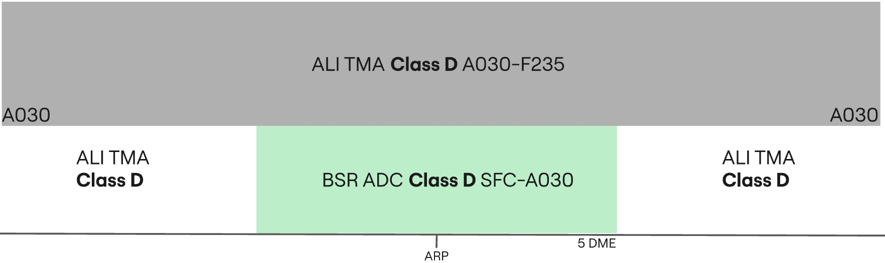

## Positions

|    Name   | Callsign	| Frequency | Login ID | Remarks |
| --------- | --------	| ---------	| -------- | ------- |
| **Basra ADC** | **Basra Tower** | **118.700** | **ORMM_TWR** | |
| **Basra SMC** | **Basra Ground** | **121.700** | **ORMM_GND**	| |
| **Basra ATIS** | | **124.520** | **ORMM_ATIS** | |

## Airspace - Class D

ORMM_TWR is responsible for the Basra CTR airspace from `SFC` to `A030`.

## VFR Operations
All VFR clearances are assigned by the revelant TWR controller.

### Circuits
VFR Circuits are permitted on runways **32** and **14**.

All VFR aircraft wishing to do remain in the circuit at Basra shall be issued `A030` and the following circuit directions:

| Runway | Direction |
| ------ | --------- |
|   32   | Left |
|   14   | Right |

!!! phraseology
    **ABC**: Basra Tower, ABC holding short D runway 32, ready for departure.  
    **BSR ADC**: ABC, Basra Tower, cleared to operate in the circuit area not above altitude 3000ft, left hand circuits report on the downwind, surface winds 320 degrees 5 knots, cleared for take-off runway 32.  
    **ABC**: Cleared to operate in the circuit area not above altitude 3000ft, will report on the left downwind, cleared for take-off runway 32, ABC.  

VFR Circuits shall **not** be permitted at the aerodrome during times of increased IFR departure or arrival activity.

### Leaving the CTR
Once VFR aircraft are ready for departure, they shall be cleared for take-off in sequence. As they begin their crosswind turn they shall be instructed to report leaving the CTR. VFR procedures inside the Basra CTR must be conducted at or below `A030`.

!!! phraseology
    **FYI**: Basra Tower, FYI holding short D runway 32.  
    **BSR ADC**: FYI, Basra Tower, surface winds 320 degrees 5 knots, cleared for take-off runway 32.  
    **FYI**: Roger, cleared for take-off runway 18.  
    **AIRCRAFT ON THE CROSSWIND TURN**  
    **BSR ADC**: FYI, report leaving the Basra CTR, maintain at or below altitude 3000ft.  
    **FYI**: At or below 3000ft, wilco, FYI.

Aircraft requesting to exit the Basra CTR shall be assigned a clearance limit followed by a valid VFR cruising altitude (+500ft).

!!! phraseology
    **YYC**: Basra Tower, YYC is requesting to exit the Basra CTR via direct Al-Najaf, altitude 5500ft.  
    **BSR ADC**: YYC, Basra Tower, cleared to leave the Basra CTR direct Al-Najaf, maintain altitude 5500ft, squawk 7403, QNH 998 hectopascals.  
    **YYC**: Cleared to leave the Basra CTR direct Al-Najaf, maintain altitude 5500ft, QNH 998, and squawk 7403, YYC.

### Entering the CTR
Inbound VFR aircraft shall be sent to **ADC** with enough time such that two-way
radio communications have been established before aircraft receive clearance to enter the CTR.

On initial contact, Erbil **ADC** will pass the instructions for joining the circuit, as well as any other pertinent information such as traffic information with the sector.

!!! phraseology
    **YYC**: Basra Tower, YYC is requesting to enter the Basra CTR from the North for circuits.     
    **BSR ADC**: YYC, Basra Tower, information A, cleared to enter the Basra CTR, maintain at or below altitude 3000ft, report left downwind runway 32 with intentions, squawk 7403.  
    **YYC**: We have A, cleared to enter the Basra CTR, at or below altitude 3000ft, will report left downwind runway 32 with intentions, squawk 7403, YYC.   
    **BSR ADC**: YYC, correct, QNH 998 hectopascals.    

During times of heavy IFR arrival activity, VFR arrivals may be denied entry into the CTR and instructed to hold outside of the CTR awaiting further instructions.

## IFR Operations
IFR clearances are issued by Basra **SMC**, ensuring appropriate routing.

All IFR departures must fly an omni-directional departure.

### Omni-directional Departures
Departing IFR aircraft shall always fly an omni-directional departure. **SMC** must adjust their phraseology accordingly. 

!!! phraseology
    **IAW123**: Basra Ground, IAW123, request clearance to Antalya, with information Alpha.  
    **BSR SMC**: IAW123, Basra Ground, Cleared to Antalya, flight planned route, squawk 4301.  

### Arrivals
At Basra, **ORMM_TWR** is responsible for the entirety of the CTR, and is required to provide top-down service if the underlying **SMC** controller is offline.

!!! phraseology
    **IAW123**: Sulaymaniyah Tower, IAW123, overhead SUL VOR, descending through 7000ft.  
    **BSR ADC**: IAW123, Sulaymaniyah Tower, salam, report established on the ILS runway 32.  

## Standard Taxi Routes
All departing aircraft shall be assigned the most appropriate taxiway, onto taxiway T. Basra **SMC** must exercise extreme caution on taxiway T, and ensure handoffs are made to Basra **ADC** efficiently, as conflicts can easily occur between arriving and departing traffic. 

## Runway Modes
### Preferred Runway Modes
Winds must always be considered for Runway modes (Crosswind <20kts, Tailwind <5kts), however the order of preference is as follows:

| Priority - Mode | Arrivals | Departures | Remarks |
| --------------- | -------- | ---------- | ------- |
| 1 - MODE A | 32 | 32 | |
| 2 - MODE B | 14 | 14 | |

!!! note
    The preferential runway is runway 32, as it has a published ILS approach procedure, unlike runway 14.

## Coordination
### Departure Procedures
Due to the airspace structure in Basra, all departures shall be coordinated with the relevant **TMA** controller (ORMM_APP) before release.

'Next' coordination is **not** required to Baghdad **TMA** for aircraft that are:

- Departing from a runway nominated on the ATIS; and
- Assigned the Standard assignable level; and
- Assigned a **Standard Assignable Heading**

'Next' coordination is additionally required for:

- Visual depatures (eg. VFR aircraft)
- All departures not on a Standard Assignable Heading
- After a go around, the next departure from that runway

The Standard Assignable level from Basra **ADC** to Baghdad **TMA** is:

| Aircraft | Level |
| -------- | ----- |
| IFR | `A100` |
| VFR | `A030` |

### Standard Assignable Departure Headings
As there are no SIDs in Basra, aircraft must recieve an assigned heading with their line up or take-off clearance. 'Next' coordination is not required to the relevant Baghdad **TMA** controller when the departing aircraft has been assigned the standard assignable level and assigned one of the headings listed below:

| Runway | Heading |
| ------ | ------- |
| 32 | `H315` |
| 14 | `H135` |

!!! tip
    If strong winds are present at altitude, **ADC/TMA** should discuss slight changes to these headings (+/- 5 degrees) to compensate for large crosswind components.

!!! phraseology
    **IAW23**: Basra Tower, IAW23 ready for departure.  
    **BSR ADC**: IAW23, after departure climb to altitude 10,000ft, fly runway heading, surface winds variable at 3 knots, runway 32 cleared for take-off.
