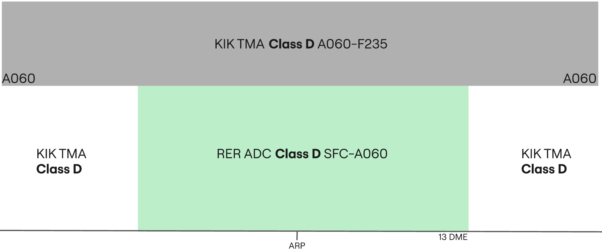

--8<-- "includes/abbreviations.md"

## Positions

|    Name   | Callsign	| Frequency | Login ID | Remarks |
| --------- | --------	| ---------	| -------- | ------- |
| **Erbil ADC** | **Erbil Tower** | **128.800** | **ORER_TWR** | |
| **Erbil ATIS** | | **130.400** | **ORER_ATIS** | |

## Airspace - Procedural Class D

ORER_TWR is responsible for the Erbil CTR airspace from `SFC` to `A060`.

## VFR Operations
All VFR clearances are assigned by the revelant TWR controller.

### Circuits
VFR Circuits are permitted on runways **36** and **18**.

All VFR aircraft wishing to do remain in the circuit at Erbil shall be issued not above `A060` and the following circuit directions:

| Runway | Direction |
| ------ | --------- |
|   18   | Right |
|   36   | Left |

!!! phraseology
    **ABC**: Erbil Tower, ABC holding short A1 runway 18.  
    **RER ADC**: ABC, Erbil Tower, cleared to operate in the circuit area not above altitude 6000ft, right hand circuits report on the downwind, surface winds 320 degrees 5 knots, cleared for take-off runway 18.  
    **ABC**: Cleared to operate in the circuit area not above altitude 6000ft, will report on the right downwind, cleared for take-off runway 18, ABC.

VFR Circuits shall **not** be permitted at the aerodrome during times of increased IFR departure or arrival activity.

### Leaving the CTR
Once VFR aircraft are ready for departure, they shall be cleared for take-off in sequence. As they begin their crosswind turn they shall be instructed to report leaving the CTR. VFR procedures inside the Erbil CTR must be conducted at or below `A060`.

!!! phraseology
    **FYI**: Erbil Tower, FYI holding short A1 runway 18.  
    **RER ADC**: FYI, Erbil Tower, surface winds 320 degrees 5 knots, cleared for take-off runway 18.  
    **FYI**: Roger, cleared for take-off runway 18.  
    **AIRCRAFT ON THE CROSSWIND TURN**  
    **RER ADC**: FYI, report leaving the Erbil CTR, maintain at or below altitude 6000ft.  
    **FYI**: At or below 6000ft, wilco, FYI.

Aircraft requesting to exit the Erbil CTR shall be assigned a clearance limit followed by a valid VFR cruising altitude (+500ft).

!!! phraseology
    **YYC**: Erbil Tower, YYC is requesting to exit the Erbil CTR via direct Kirkuk, altitude 5500ft.  
    **RER ADC**: YYC, Erbil Tower, cleared to leave the Erbil CTR direct Kirkuk, maintain altitude 5500ft, squawk 7403, QNH 998 hectopascals.  
    **YYC**: Cleared to leave the Erbil CTR direct Kirkuk, maintain altitude 5500ft, QNH 998, and squawk 7403, YYC.

### Entering the CTR
Inbound VFR aircraft shall be sent to **ADC** with enough time such that two-way
radio communications have been established before aircraft receive clearance to enter the CTR.

On initial contact, Erbil **ADC** will pass the instructions for joining the circuit, as well as any other pertinent information such as traffic information with the sector.

!!! phraseology
    **YYC**: Erbil Tower, YYC is requesting to enter the Erbil CTR from the south for circuits.     
    **RER ADC**: YYC, Erbil Tower, information A, cleared to enter the Erbil CTR, maintain at or below altitude 6000ft, report right downwind runway 18 with intentions, squawk 7403.  
    **YYC**: We have A, cleared to enter the Erbil CTR, at or below altitude 6000ft, will report right downwind runway 18 with intentions, squawk 7403, YYC.   
    **RER ADC**: YYC, correct, QNH 998 hectopascals.    

During times of heavy IFR arrival activity, VFR arrivals may be denied entry into the CTR and instructed to hold outside of the CTR awaiting further instructions.

## IFR Operations
IFR clearances are issued by Erbil **ADC**, ensuring appropriate routing.

### Standard Instrument Departures (SIDs)
All aircraft shall be assigned a Standard Instrument Departure 

Controllers shall assign the proper SID exit waypoint based on the first enroute waypoint in their
flight plan, and the proper procedure identifier based on the selected runway for departure.
All SIDs with an identifier of 1N are valid for runway 36. SIDs
with an identifier of 1S are valid for runway 18. 
Listed below are the SIDs:

|   SID   | 36 | 18 |
| ------- | -- | -- |
|  DAVAS  | 1N | 1S |   
|  EMIDO  | 1N | 1S | 
|  ROXOP  | 1N | 1S |  
|  UMESA  | 1N | 1S |

Departures should primarily adhere to the Standard Instrument Departure (SID) routes, avoiding
radar vectors whenever feasible. If radar vectors are to be assigned, a specific reason must be
provided. 

!!! phraseology
    **IAW123**: Erbil Tower, IAW123, request clearance to Antalya, with information Alpha.  
    **RER ADC**: IAW123, Erbil Tower, cleared to Antalya, EMID1S departure, flight planned route, initial climb 6000ft, squawk 4301. 

### Omni-directional Departures
Aircraft can only be assigned an omni-directional departure if they are unable to fly the SIDs.

!!! phraseology
    **IAW123**: Erbil Tower, IAW123, request clearance to Antalya, with information Alpha.  
    **RER ADC**: IAW123, Erbil Tower, cleared to Antalya, expect omni-directional departure, flight planned route, squawk 4301. 

### Arrivals
In addition to aircraft on the ground at Erbil, **ORER_TWR** is also responsible for airborne arrivals and
departures at and below 6,000ft. Special caution must be taken due to terrain to the east of the airport. As is the procedure at procedural airports, due to the lack of radar, only one aircraft must operate in the non-radar procedural airspace at one time.

!!! phraseology
    **IAW123**: Erbil Tower, IAW123, inbound ILS-Z runway 18, descending through 7000ft.  
    **RER ADC**: IAW123, Erbil Tower, salam, report established on the ILS runway 18.  

## Standard Taxi Routes
All departing aircraft shall be assigned the most appropriate taxiway, onto taxiway A. Erbil **ADC** must exercise extreme caution on taxiway A, as conflicts can easily occur between arriving and departing traffic. Taxiway B is restricted to military traffic only.

## Runway Modes
### Preferred Runway Modes
Winds must always be considered for Runway modes (Crosswind <20kts, Tailwind <5kts), however the order of preference is as follows:

| Priority - Mode | Arrivals | Departures | Remarks |
| --------------- | -------- | ---------- | ------- |
| 1 - MODE A | 18 | 18 | |
| 2 - MODE B | 36 | 36 | |

!!! note  
    The preferential runway for both departures and arrivals is **runway 18** and shall be used when the
    tailwind component is less than 8 knots.

## Coordination

### Departure Procedures
Due to the airspace structure in Erbil, all departures shall be coordinated and receive a release for departure with the relevant Baghdad **TMA** controller (ORKK_APP) before release.

'Next' coordination is **not** required to Baghdad **TMA** for aircraft that are:

- Departing from a runway nominated on the ATIS; and
- Assigned the Standard assignable level; and
- Assigned a **Procedural SID**; or
- Assigned a **Standard Assignable Heading**

'Next' coordination is additionally required for:

- Visual depatures (eg. VFR aircraft)
- All departures not on a Standard Assignable Heading
- After a go around, the next departure from that runway

The Standard Assignable level from Erbil **ADC** to Baghdad **TMA** is:

| Aircraft | Level |
| -------- | ----- |
| IFR | `A060` |
| VFR | `A060` |

### Standard Assignable Departure Headings
If a departing aircraft is receiving an omni-directional departure, they must recieve an assigned heading with their line up or take-off clearance. 'Next' coordination is not required to the relevant Baghdad **TMA** controller when the departing aircraft has been assigned the standard assignable level and assigned one of the headings listed below:

| Runway | Heading |
| ------ | ------- |
| 18 | `H175` |
| 36 | `H355` |

!!! tip
    If strong winds are present at altitude, **ADC/TMA** should discuss slight changes to these headings (+/- 5 degrees) to compensate for large crosswind components.

!!! phraseology
    **IAW23**: IAW23 ready for departure.  
    **RER ADC**: IAW23, after departure climb to altitude 6000ft, fly runway heading, surface winds variable at 3 knots, runway 18 cleared for take-off.

