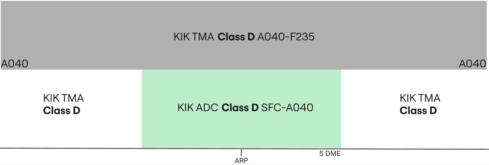

--8<-- "includes/abbreviations.md"

## Positions

|    Name   | Callsign	| Frequency | Login ID | Remarks |
| --------- | --------	| ---------	| -------- | ------- |
| **Kirkuk ADC** | **Kirkuk Tower** | **125.550** | **ORKK_TWR** | |
| **Kirkuk SMC** | **Kirkuk Ground** | **127.375** | **ORKK_GND**	| |

## Airspace - Class D

ORKK_TWR is responsible for the Kirkuk CTR airspace from `SFC` to `A040`.

## VFR Operations
All VFR clearances are assigned by the revelant TWR controller.

!!! warning   
    At Kirkuk, runway **32/14** is closed, hence no VFR traffic is to make use of this runway.

### Circuits
VFR Circuits are permitted on runways **13** and **31**. 

All VFR aircraft wishing to do remain in the circuit at Kirkuk shall be issued `A040` and the following circuit directions:

| Runway | Direction |
| ------ | --------- |
|   31   |   Left   |
|   13   |   Right    |

!!! phraseology
    **ABC**: Kirkuk Tower, ABC holding short D runway 31, full ready.    
    **KIK ADC**: ABC, Kirkuk Tower, cleared to operate in the circuit area not above altitude 4000ft, left hand circuits report on the downwind, surface winds 320 degrees 5 knots, cleared for take-off runway 31.  
    **ABC**: Cleared to operate in the circuit area not above altitude 4000ft, will report on the left downwind, cleared for take-off runway 31, ABC.  

VFR Circuits shall **not** be permitted at the aerodrome during times of increased IFR departure or arrival activity.

### Leaving the CTR
Once VFR aircraft are ready for departure, they shall be cleared for take-off in sequence. As they begin their crosswind turn they shall be instructed to report leaving the CTR. VFR procedures inside the Kirkuk CTR must be conducted at or below `A040`.

!!! phraseology
    **FYI**: Kirkuk Tower, FYI holding short D, runway 31.  
    **KIK ADC**: FYI, Kirkuk Tower, surface winds 320 degrees 5 knots, cleared for take-off runway 31.  
    **FYI**: Roger, cleared for take-off runway 31.  
    **AIRCRAFT ON THE CROSSWIND TURN**  
    **KIK ADC**: FYI, report leaving the Kirkuk CTR, maintain at or below altitude 4000ft.  
    **FYI**: At or below 4000ft, wilco, FYI.

Aircraft requesting to exit the Kirkuk CTR shall be assigned a clearance limit followed by a valid VFR cruising altitude (+500ft).

!!! phraseology
    **YYC**: Kirkuk Tower, YYC is requesting to exit the Kirkuk CTR via direct Erbil, altitude 7500ft.  
    **KIK ADC**: YYC, Kirkuk Tower, cleared to leave the Kirkuk CTR direct Erbil, maintain altitude 7500ft, squawk 7403, QNH 998 hectopascals.  
    **YYC**: Cleared to leave the Kirkuk CTR direct Erbil, maintain altitude 7500ft, QNH 998, and squawk 7403, YYC.

### Entering the CTR
Inbound VFR aircraft shall be sent to **ADC** with enough time such that two-way
radio communications have been established before aircraft receive clearance to enter the CTR.

On initial contact, Kirkuk **ADC** will pass the instructions for joining the circuit, as well as any other pertinent information such as traffic information with the sector.

!!! phraseology
    **YYC**: Kirkuk Tower, YYC is requesting to enter the Kirkuk CTR from the southeast for circuits.     
    **KIK ADC**: YYC, Kirkuk Tower, information A, cleared to enter the Kirkuk CTR, maintain at or below altitude 4000ft, report final runway 31 with intentions, squawk 7403.  
    **YYC**: We have A, cleared to enter the Kirkuk CTR, at or below altitude 4000ft, will report final runway 31 with intentions, squawk 7403, YYC.   
    **KIK ADC**: YYC, correct, QNH 998 hectopascals.    

During times of heavy IFR arrival activity, VFR arrivals may be denied entry into the CTR and instructed to hold outside of the CTR awaiting further instructions.

## IFR Operations
IFR clearances are issued by Kirkuk **SMC**, ensuring appropriate routing. IFR departures shall always be assigned runway 31/13.

All departing aircrat will fly an omni-directional departure.

!!! warning   
    At Kirkuk, runway **32/14** is closed, hence no IFR traffic is to make use of this runway.

### Omni-directional Departures
Departing IFR aircraft shall always fly an omni-directional departure. **SMC** must adjust their phraseology accordingly. 

!!! phraseology
    **IAW123**: Kirkuk Ground, IAW123, request clearance to Antalya, with information Alpha.  
    **KIK SMC**: IAW123, Kirkuk Ground, Cleared to Antalya, expect omni-directional departure, flight planned route, squawk 4301.  

### Arrivals
At Kirkuk, **ORKK_TWR** is responsible for the entirety of the CTR, and is required to provide top-down service if the underlying **SMC** controller is offline.

!!! phraseology
    **IAW123**: Kirkuk Tower, IAW123, final runway 31.
    **KIK ADC**: IAW123, Kirkuk Tower, salam, winds 260 degrees at 8 knots, runway 31 cleared to land.  

## Standard Taxi Routes
All departing aircraft shall be assigned the most appropriate taxiway, onto taxiway A, or the runway holding point. Kirkuk **SMC** must exercise extreme caution on taxiway A, as conflicts can easily occur between arriving and departing traffic.

## Runway Modes
### Preferred Runway Modes
Winds must always be considered for Runway modes (Crosswind <20kts, Tailwind <5kts), however the order of preference is as follows:

| Priority - Mode | Arrivals | Departures | Remarks |
| --------------- | -------- | ---------- | ------- |
| 1 - MODE A | 31 | 31 | |
| 2 - MODE B | 13 | 13 | |

!!! note  
    The preferential runway is runway 31. 

## Coordination
### Departure Procedures
Due to the airspace structure in Kirkuk, all departures shall be coordinated and receive a release for departure with the relevant Baghdad **TMA** controller (ORKK_APP) before release.

'Next' coordination is **not** required to Baghdad **TMA** for aircraft that are:

- Departing from a runway nominated on the ATIS; and
- Assigned the Standard assignable level; and
- Assigned a **Standard Assignable Heading**

'Next' coordination is additionally required for:

- Visual depatures (eg. VFR aircraft)
- All departures not on a Standard Assignable Heading
- After a go around, the next departure from that runway

The Standard Assignable level from Kirkuk **ADC** to Baghdad **TMA** is:

| Aircraft | Level |
| -------- | ----- |
| IFR | `A040` |
| VFR | `A040` |

### Standard Assignable Departure Headings
All aircraft that are flying an omni-directional departure must recieve an assigned heading with their line up or take-off clearance. 'Next' coordination is not required to the relevant Baghdad **TMA** controller when the departing aircraft has been assigned the standard assignable level and assigned one of the headings listed below:

| Runway | Heading |
| ------ | ------- |
| 13 | `H128` |
| 31 | `H308` |

!!! tip
    If strong winds are present at altitude, **ADC/TMA** should discuss slight changes to these headings (+/- 5 degrees) to compensate for large crosswind components.

!!! phraseology
    **IAW23**: IAW23 ready for departure.  
    **KIK ADC**: IAW23, after departure climb to altitude 4000ft, fly runway heading, surface winds variable at 3 knots, runway 31 cleared for take-off.

