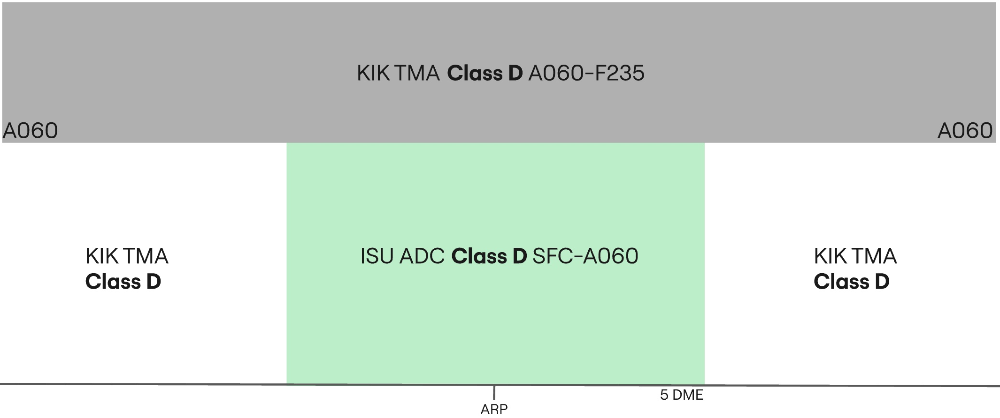

--8<-- "includes/abbreviations.md"

## Positions

|    Name   | Callsign	| Frequency | Login ID | Remarks |
| --------- | --------	| ---------	| -------- | ------- |
| **Sulaimaniyah ADC** | **Sulaymaniyah Tower** | **118.300** | **ORSU_TWR** | |

## Airspace - Procedural Class D

ORSU_TWR is responsible for the Sulaymaniyah CTR airspace from `SFC` to `A060`.

## VFR Operations
All VFR clearances are assigned by the revelant TWR controller.

### Circuits
VFR Circuits are permitted on runways **13** and **31**.

All VFR aircraft wishing to do remain in the circuit at Sulaimaniyah shall be issued `A060` and the following circuit directions:

| Runway | Direction |
| ------ | --------- |
|   31   |    Left   |
|   13   |   Right   |

!!! phraseology
    **ABC**: Sulaimaniyah Tower, ABC holding short E runway 31, full ready.    
    **ISU ADC**: ABC, Sulaimaniyah Tower, cleared to operate in the circuit area not above altitude 6000ft, left hand circuits report on the downwind, surface winds 320 degrees 5 knots, cleared for take-off runway 31.  
    **ABC**: Cleared to operate in the circuit area not above altitude 3000ft, will report on the left downwind, cleared for take-off runway 31, ABC.  

VFR Circuits shall **not** be permitted at the aerodrome during times of increased IFR departure or arrival activity.

### Leaving the CTR
Once VFR aircraft are ready for departure, they shall be cleared for take-off in sequence. As they begin their crosswind turn they shall be instructed to report leaving the CTR. VFR procedures inside the Sulaimaniyah CTR must be conducted at or below `A060`.

!!! phraseology
    **FYI**: Sulaimaniyah Tower, FYI holding short E, runway 31.  
    **ISU ADC**: FYI, Sulaimaniyah Tower, surface winds 320 degrees 5 knots, cleared for take-off runway 31.  
    **FYI**: Roger, cleared for take-off runway 31.  
    **AIRCRAFT ON THE CROSSWIND TURN**  
    **ISU ADC**: FYI, report leaving the Sulaimaniyah CTR, maintain at or below altitude 6000ft.  
    **FYI**: At or below 6000ft, wilco, FYI.

Aircraft requesting to exit the Sulaimaniyah CTR shall be assigned a clearance limit followed by a valid VFR cruising altitude (+500ft).

!!! phraseology
    **YYC**: Sulaimaniyah Tower, YYC is requesting to exit the Sulaimaniyah CTR via direct Erbil, altitude 7500ft.  
    **ISU ADC**: YYC, Sulaymaniiah Tower, cleared to leave the Sulaimaniyah CTR direct Erbil, maintain altitude 7500ft, squawk 7403, QNH 998 hectopascals.  
    **YYC**: Cleared to leave the Sulaimaniyah CTR direct Erbil, maintain altitude 7500ft, QNH 998, and squawk 7403, YYC.

### Entering the CTR
Inbound VFR aircraft shall be sent to **ADC** with enough time such that two-way
radio communications have been established before aircraft receive clearance to enter the CTR.

On initial contact, Sulaimaniyah **ADC** will pass the instructions for joining the circuit, as well as any other pertinent information such as traffic information with the sector.

!!! phraseology
    **YYC**: Sulaimaniyah Tower, YYC is requesting to enter the Sulaimaniyah CTR from the southeast for circuits.     
    **ISU ADC**: YYC, Sulaimaniyah Tower, information A, cleared to enter the Sulaimaniyah CTR, maintain at or below altitude 6000ft, report final runway 31 with intentions, squawk 7403.  
    **YYC**: We have A, cleared to enter the Sulaimaniyah CTR, at or below altitude 6000ft, will report final runway 31 with intentions, squawk 7403, YYC.   
    **ISU ADC**: YYC, correct, QNH 998 hectopascals.    

During times of heavy IFR arrival activity, VFR arrivals may be denied entry into the CTR and instructed to hold outside of the CTR awaiting further instructions.

## IFR Operations
IFR clearances are issued by Sulaimaniyah **ADC**, ensuring appropriate routing.

Aircraft flying IFR may either fly a SID that fly to either waypoint KIRKUK or ERBIL, **or** an omnidirectional departure.

### Standard Instrument Departures
Sulaimaniyah makes use of SIDs that fly to either waypoint KIRKUK or ERBIL.

The departure shall be assigned based on the departure waypoint, based on which of these two waypoints is closest to the aircraft’s flight planned route. The SID is designed to allow aircraft to pass the waypoints PUTRI or RASKI, both located 10nm from SUL, at or above `A110`, to avoid terrain to the west and shall be transferred to Kirkuk TMA when passing `A060`

The Standard Instrument Departures available are:

|   SID   | 31|13 | 
| ------- | - | - |
|  ERBIL  | 1 | 2 |
|  KIRKK  | 1 | 2 |

!!! warning
    These departures may **only** be assigned to aircraft departing towards waypoints KIRKUK or ERBIL, other IFR departures shall receive an omni-directional departure.

The departure runway does not need to be included within the clearance, as these SIDs are runway specific.

!!! phraseology
    **IAW123**: Sulaimaniyah Tower, IAW123, request clearance to Antalya, with information Alpha.  
    **ISU ADC**: IAW123, Sulaimaniyah Tower, Cleared to Antalya, KIRKK1 departure, flight planned route, initial climb 6,000 ft, squawk 4301. 

### Omni-directional Departures
Departing IFR aircraft shall fly an omni-directional departure, if they are not flying a SID.

If an aircraft are flying an omnidirectional to one of these waypoints, the Sulaimaniyah VOR (SUL) shall always be their first waypoint in the clearance. Followed by one of the following waypoints to join their flight-planned route:  
- TOMSI  
- BOXIX  
- SOBIL  
- MUTAG  

!!! phraseology
    **IAW123**: Sulaimaniyah Tower, IAW123, request clearance to Antalya, with information Alpha.  
    **ISU ADC**: IAW123, Sulaimaniyah Tower, Cleared to Antalya, expect omni-directional departure, flight planned route, squawk 4301.  

### Arrivals
In addition to aircraft on the ground at Sulaimaniyah, **ORSU_TWR** is also responsible for airborne
arrivals and departures at and below 6,000ft. As is the procedure at procedural airports, due to the lack
of radar, only one aircraft must operate in the non-radar procedural airspace at one time.

Arrivals are transferred to Sulaimaniyah **ADC** from Baghdad **TMA** at 7,000ft or 8,000ft, following
either the ERBIL1, ERBIL2, KIRKK1, KIRKK2 arrivals.

!!! phraseology
    **IAW123**: Sulaimaniyah Tower, IAW123, overhead SUL VOR, descending through 7000ft.  
    **ISU ADC**: IAW123, Sulaimaniyah Tower, salam, report established on the ILS runway 31.  

## Standard Taxi Routes
All departing aircraft shall be assigned the most appropriate taxiway, onto taxiway A. Sulaimaniyah **ADC** must exercise extreme caution on taxiway A, as conflicts can easily occur between arriving and departing traffic.

## Runway Modes
### Preferred Runway Modes
Winds must always be considered for Runway modes (Crosswind <20kts, Tailwind <5kts), however the order of preference is as follows:

| Priority - Mode | Arrivals | Departures | Remarks |
| --------------- | -------- | ---------- | ------- |
| 1 - MODE A | 31 | 31 | |
| 2 - MODE B | 13 | 13 | |

!!! note  
    The preferential runway is runway 31.

## Coordination
### Departure Procedures
Due to the airspace structure in Sulaimaniyah, all departures shall be coordinated and receive a release for departure with the relevant Baghdad **TMA** controller (ORKK_APP) before release.

'Next' coordination is **not** required to Baghdad **TMA** for aircraft that are:

- Departing from a runway nominated on the ATIS; and
- Assigned the Standard assignable level; and
- Assigned a **Procedural SID**; or
- Assigned a **Standard Assignable Heading**

'Next' coordination is additionally required for:

- Visual depatures (eg. VFR aircraft)
- All departures not on a Standard Assignable Heading
- After a go around, the next departure from that runway

The Standard Assignable level from Sulaimaniyah **ADC** to Baghdad **TMA** is:

| Aircraft | Level |
| -------- | ----- |
| IFR | `A060` |
| VFR | `A060` |

### Standard Assignable Departure Headings
As there are only 2 SIDs currently used in Sulaimaniyah, aircraft that are flying an omni-directional departure must recieve an assigned heading with their line up or take-off clearance. 'Next' coordination is not required to the relevant Baghdad **TMA** controller when the departing aircraft has been assigned the standard assignable level and assigned one of the headings listed below:

| Runway | Heading |
| ------ | ------- |
| 13 | `H130` |
| 31 | `H310` |

!!! tip
    If strong winds are present at altitude, **ADC/TMA** should discuss slight changes to these headings (+/- 5 degrees) to compensate for large crosswind components.

!!! phraseology
    **IAW23**: IAW23 ready for departure.  
    **ISU ADC**: IAW23, after departure climb to altitude 6000ft, fly runway heading, surface winds variable at 3 knots, runway 13 cleared for take-off.

