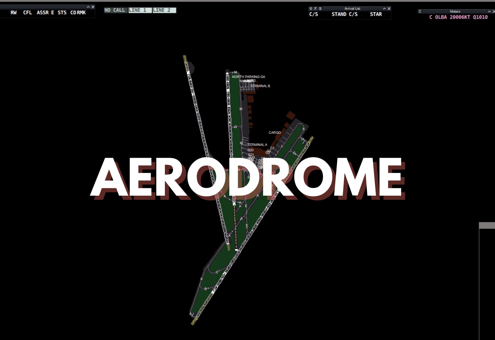

<figure markdown>

</figure>

## Scope
The following documentation outlines the general operating procedures for Levant airports at an aerodrome level. Some documents serve as supplements to the real world eAIP. These SOP(s) should be used in conjunction with the aforementioned sources. In case of any discrepancies between the aerodrome-specific procedures in this SOP and the real-world eAIP, the procedures in these SOP(s) shall take precedence.

## Included FIRs
!!! info
    The included FIRs are the Beirut FIR (OLBB), Baghdad FIR (ORBB) and Damascus FIR (OSTT)

## Limitation of Liability
!!! warning
    All documentation in this section is intended solely for use on the VATSIM network and must not be used for real-world aviation operations. The authors disclaim any liability for personal injury or death resulting from misuse of this material.

## Acknowledgements
!!! info
    This document includes excerpts and images from, and is primarily based on, ICAO Doc 4444 – PANS-ATM, along with the respective Civil Aviation Authority regulations and eAIP of each country.

