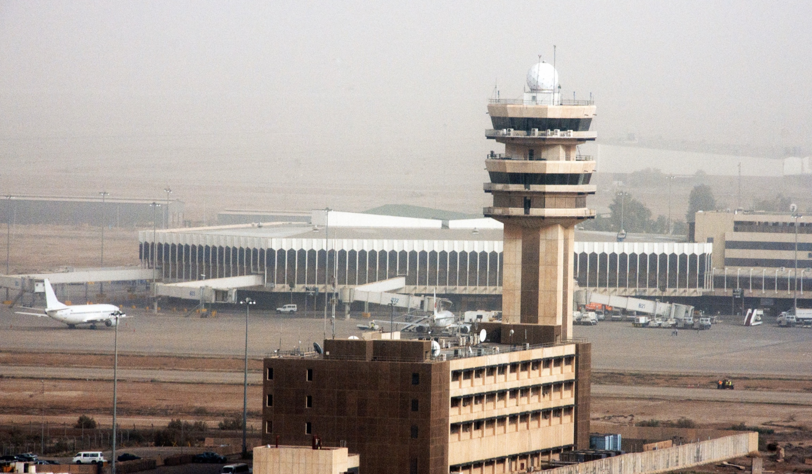
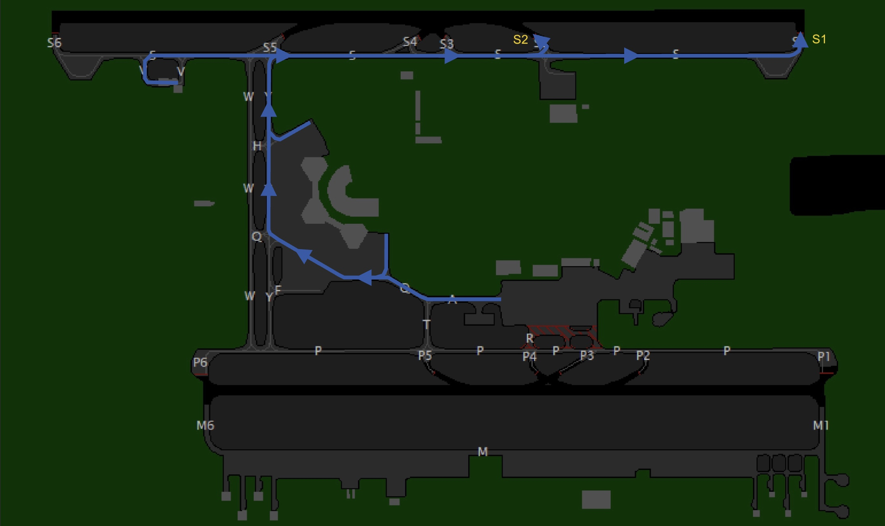
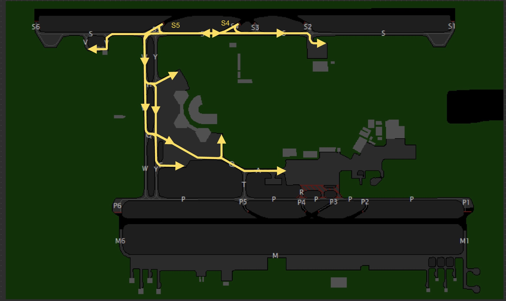

--8<-- "includes/abbreviations.md"

# Arriving Traffic
<figure markdown>

</figure>

## Runway Assignment
The arrival runway is specified in the Baghdad ATIS, with a preference for 33R arrivals.

## Approach
The standard approach at Baghdad is the ILS for runway 33R, pilots **may** request the RNP for runway 33L but this may not always be approved, depending on the current traffic situation.

## Speeds
The recommended speeds within different segments of the Baghdad terminal area is as follows:

|  Speed Range  |              Arrival Segment              |
|:-------------:|:-----------------------------------------:|
| 210 - 250 kts |           Initial approach phase          |
| 180 - 230 kts |         From downwind to base leg         |
| 160 - 210 kts |                 On base leg               |
|    190 kts    |                Until 10 DME               |
|    160 kts    |                Until 4 DME                |

All speed recommendations should try to be followed, restrictions placed by ATC **must take priority** over these recommended speeds. Aircraft unable to comply with these restrictions must notify ATC in advance and specify the speeds they can maintain. Pilots should also inform ATC if circumstances require a speed adjustment for any reason.  

To ensure accurate spacing, pilots are requested to comply with speed adjustments as promptly as practicable, considering their operational constraints.  

If traffic sequencing does not require speed limitations, ATC will advise, “**NO ATC SPEED RESTRICTION**.”  

## Landing
### Minimum Runway Occupancy
During peak traffic periods, rapid runway vacating is essential to prevent disruption to the aerodrome traffic flow. Ensure your entire aircraft has passed the designated runway holding point before considering yourself 'clear' of the runway. Avoid unnecessary stops before exiting completely.

All rapid exit taxiways are equipped with rapid taxiway indicator lights. Pilots are encouraged to maintain the designated exit taxi speed of 50 knots.

!!! info
    Pilots are **expected** to vacate runway 33R via S5, but S4 may be used to ensure no aircraft are stopping on the active runway.

## Taxi
After landing, aircraft must not stop on the rapid exit taxiways and shall continue taxiing according to the following procedures unless otherwise instructed by the tower controller:  

- **Runway 33R:** If vacated on S5 continue via W westbound, if vacated on S4 **hold short** of S.  
- **Runway 33L:** Continue via P northbound.  
- **Runway 12L:** Continue via S northbound.
- **Runway 15R:** Continue via P northbound.

The following taxi diagrams depict the standard taxi routings. Note that it may be necessary for operational reasons to deviate from these routings and pilots should follow ATC instructions at all times.

### Runway 33s Configuration
#### Departure Bias
<figure markdown>

</figure>

#### Arrival Bias
<figure markdown>

</figure>

### Runway 15s Configuration
#### Departure Bias
<figure markdown>

</figure>

#### Arrival Bias
<figure markdown>

</figure>