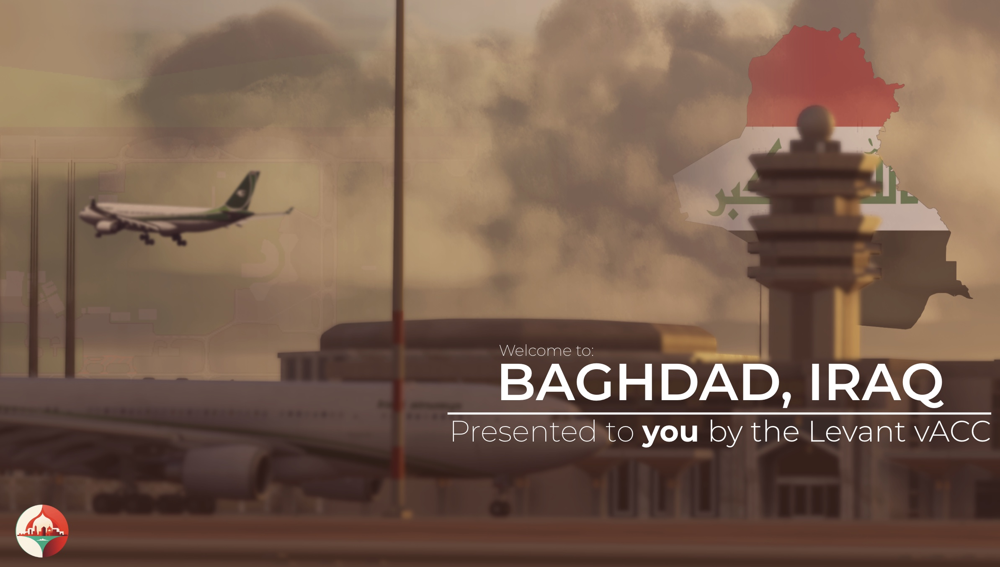
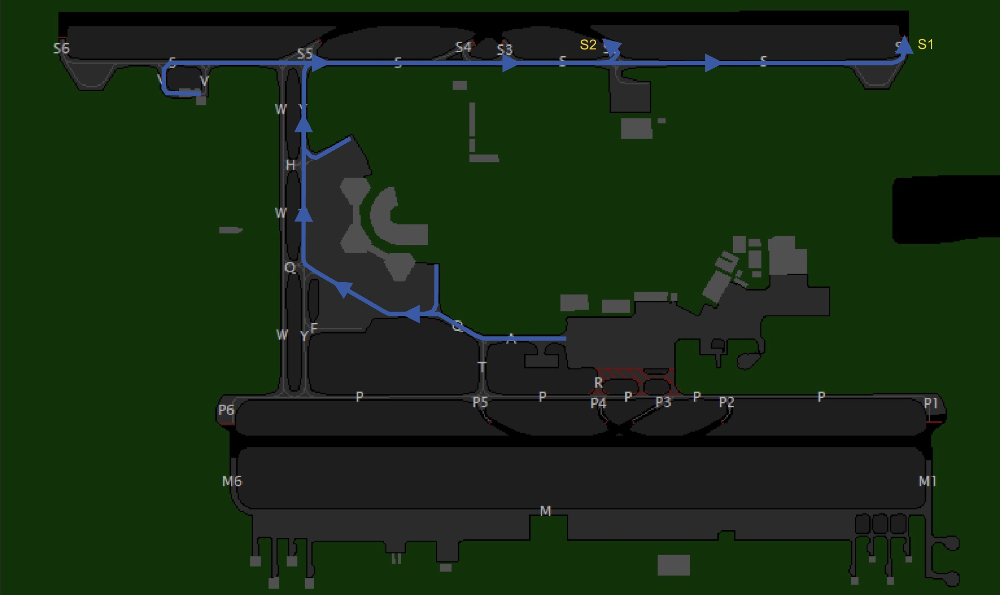
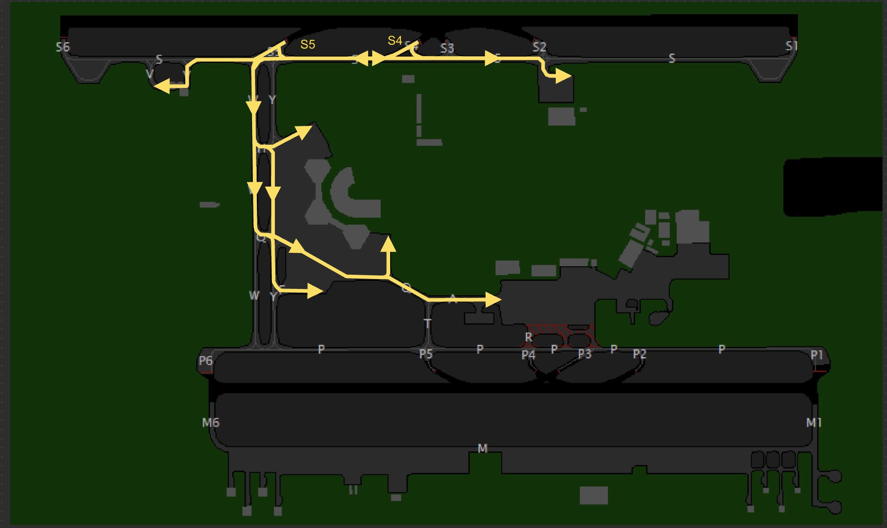

--8<-- "includes/abbreviations.md"

# Departing Traffic
<figure markdown>

</figure>

## Flight Planning: Route(s)
Pilots can find valid routes for most flights departing from Baghdad on SimBrief by choosing the "Preferred Route" option. Our operations department updates the "Preferred Route" on SimBrief with every AIRAC cycle, ensuring compliance with Air Traffic Flow Management (ATFM) regulations in the Middle East and Eurocontrol IFPS validation.

<figure markdown>
{ width="600" }
  <figcaption>Simbrief Preferred Route (1)</figcaption>
</figure>

<figure markdown>
{ width="600" }
  <figcaption>Simbrief Preferred Route (2)</figcaption>
</figure>

### Voice Clearance
Departing aircraft shall contact Baghdad Delivery **10 minutes prior to start-up** and pass the following information:
<ul>
    <li>Aircraft Callsign</li>
    <li>Aircraft Type</li>
    <li>Parking Stand</li>
    <li>Requested Flight Level</li>
    <li>Destination</li>
    <li>Current Departure ATIS Information</li>
</ul>

!!! info  
    Baghdad does not make use of DCL (Datalink Clearance), nor any PDC or CPDLC within the entire FIR, hence all communications will be via voice.  

These clearances will be very brief, covering only your squawk code, and any issues with routing where applicable. Ensure you have the latest departure ATIS information before proceeding.

!!! phraseology   
    **Pilot**: "Baghdad Delivery, good evening, IQA123, Boeing 737, stand D45, requesting FL350, to Dubai, with information F on board."  
    **Controller**: "IQA123, information F correct, cleared to Dubai via flight-planned route,  squawk 0542."  
    **Pilot**: "Cleared to Dubai, via flight-planned route, squawk 0542, IQA123."  
    **Controller**: "IQA123, readback is correct, QNH 998 hectopascals, report ready for push and start."  

!!! info
    Due to the airspace structure at Baghdad, **all aircraft** will receive their departure instructions from the tower controller in their line-up/takeoff clearances, hence no departure instructions are given by clearance delivery and pilots can expect to receive their departing instructions once handed off to tower.

!!! warning
    Clearance delivery will not provide push and start clearance. However, remain on the clearance delivery frequency; do not switch to the ground frequency on your own. You must report fully ready on the delivery frequency—this includes having the jetway disconnected, tug connected, and chocks removed. Delivery will advise when to switch to the ground frequency.

## Push and Start
Once clearance delivery releases you to the designated ground frequency, pilots may request push and start clearance. Upon initial contact, the ground controller may provide various types of pushback instructions. Pilots must ensure they can comply with these instructions; if unable, they must inform the ground controller.

Pushback clearances will specify a direction to face, such as West or East, and usually a particular taxiway to push onto.

!!! phraseology
    **Controller**: "IAW123, push and start is approved face east onto taxiway Y."

!!! warning
    If pilots are unable to commence pushback within 2-3 minutes, the pushback clearance may be revoked, and slot times will be recalculated.

## Taxi
Pilots must comply with all taxi instructions, including holds. Taxi instructions are given based on various factors such as aircraft type and traffic.

!!! phraseology
    **Controller**: "IQA123, Baghdad Ground, taxi via Y, hold short S."

### Standard Departure Points
For the purposes of takeoff performance planning the standard departure taxiways are:

* 33R - S1
* 15L - S6
* 33L - P1
* 15R - P6

Crews should base their performance calculations on departure from standard departure points from the notified runway in use.

ATC may tactically use a different 'intersection' departure point depending on the traffic situation. On first contact with Baghdad tower, pilots are to notify if they are able to depart from one of the nominated 'intersection' departure points listed below:

* 33R - S2
* 15L - S5
* 33L - P2
* 15R - P5

The following taxi diagrams depict the standard taxi routings. Note that it may be necessary for operational reasons to deviate from these routings and pilots should follow ATC instructions at all times.

### Runway 33s Configuration
#### Departure Bias
<figure markdown>

</figure>

#### Arrival Bias
<figure markdown>

</figure>

### Runway 15s Configuration
#### Departure Bias
<figure markdown>

</figure>

#### Arrival Bias
<figure markdown>

</figure>

## Take-off
### Departure Instructions
Pilots are to monitor the tower frequency carefully, as tower will give the departure instructions for all aircraft.

#### Standard Assignable Departure Headings
As there are no SIDs in Baghdad, aircraft must recieve an assigned heading with their line up or take-off clearance. Pilots can expect one of the headings below:

| Runway | Heading |
| ------ | ------- |
| 33R | `H325`, `H250` |
| 33L | `H325`, `H250` |
| 15R | `H145` |
| 15L | `H145` |

#### Aircraft 'Turn Altitudes'
Pilots will be instructed to 'turn' upon passing a certain altitude, these altitudes are listed below:

| Runway | Altitude |
| ------ | -------- |
| 33R | `A012` |
| 33L | `A010` |
| 15R | `A007` |
| 15L | `A006` |

!!! phraseology
    **IAW23**: Baghdad Tower, IAW23 ready for departure.  
    **BI ADC**: IAW23, after departure climb to altitude 6000ft, passing 1200ft turn left heading 250. Surface winds variable at 3 knots, runway 33R cleared for take-off.

