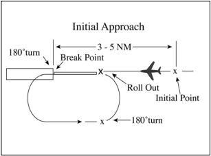

--8<-- "includes/abbreviations.md"

!!! failure "These procedures are not to be used and are still WIP"

## Positions

| Name | Callsign	| Frequency | Login ID | Remarks |
| ---- | --------	| ---------	| -------- | ------- |
| **Al-Asad ADC** | **Al-Asad Tower** |**xxx.xxx** | **ORAA_TWR** | |
| **Al-Asad SMC** | **Al-Asad Ground** | **xxx.xxx**| **ORAA_GND**	| |
| **Al-Asad ATIS** | | **xxx.xxx** | **ORAA_ATIS** | |

## Airspace - MATZ
ORAA_TWR is responsible for the Al-Asad MATZ airspace from `SFC` to `A030`.

## Aerodrome Information
Al-Asad is an airbase located in Western Iraq, located in the center of the R414 (ARCHER) restricted airspace. The airbase consists of 3 runways, including 2 dependant parallel runways (27L/09R) and (27R/09L), and a grass airstrip located on the southern portion of the aerodrome (08/26).

## Aerodrome
### Logon 
Upon logging on Al-Asad ADC it is essential to annouce the activation status of R414
!!! phraseology
    **IQA ADC -> ORBB_N_CTR**: Request activation of R414 from SFC to A030

### Flight Categories
Recovering military aircraft will usually be flying IFR, but must revert to VFR at the following points:

- At the initial point when recovering via military stream landing pattern (initial and pitch).
- At High-Key.
- Following a touch and go, go-around, overhead break, or visual overshoot when a local IFR aircraft has indicated an intention to join the circuit.

### Runway Modes
Dependant Parallel Runway Operations

### Circuit Procedures
The Al-Asad Military Air Traffic Zone (AA MATZ) is active at all times when R414 (ARCHER) is active.

Circuit Operations shall occur within a `5NM` radius of IQA ARP, at the following altitudes:

|     Type    | Normal Altitude |
| ----------- | --------------- |
|     Jet     |      `A020`     |
|   Non-Jet   |      `A010`     |

All Circuit clearances shall be issued by Al-Asad **ADC**, or by Al-Asad **SMC** in coordination with **ADC** prior.

#### Circuit Direction
Visual Circuits are allowed on both runways 27L/09R and 27R/09L, runway 08/26 is not suitable for most fixed-wing aircraft, hence shall not be used for circuits.

| Runway | Direction |
| ------ | --------- |
|  27L    |   Left   |
|  09R    |   Right  |
|  27R   |   Right   |
|  09L   |   Left    |

!!! phraseology  
    **COBRA7**: Al-Asad Tower, COBRA7, flight of 2 F16's, on taxiway K, request departure to remain in circuits, information B.  
    **ORAA ADC**: COBRA7, Al-Asad Tower, cleared left hand circuit runway runway 27L, maintain alitude 2000ft, remain this frequency, report fully ready.  
    **COBRA7**: Left hand circuits 27L, maintain 2000ft, on your frequency, fully ready.  
    **ORAA ADC**: COBRA7, roger, winds 280 degrees 3 knots, runway 27L cleared for takeoff, report downwind midfield with intentions, departure end cable indicates raised.  

### IFR Departures

!!! phraseology
    **IQA SMC**: COBRA7, Al-Asad Ground, you are cleared to Balad airbase, expect omnidirection departure, runway 27L, climb flight level 230, departure frequency victor 3, squawk 6275.   
    **COBRA7**: cleared Balad, omnidirection runway 27L, climb level 230, departures on victor 3, squawking 6275.  
    **IQA SMC**: readback correct, information B, QNH 996 hectopascals, report ready for start.
        
!!! phraseology  
    **IQA ADC**: COBRA7 winds 260 degrees at 6 knots, runway 27R cleared for takeoff, departure end cable indicates raised, switch to approach, cya!  

### Military Procedures
Military aircraft are entitled to different and more complex procedures than a normal civil fixed-wing aircraft.

#### Overhead Maneuver

Pilots operating in accordance with an IFR flight plan in Visual Meteorological Conditions (VMC) may request ATC authorization for an overhead maneuver (overhead break). An overhead maneuver is not an instrument approach procedure. An aircraft conducting an overhead maneuver is considered to be VFR and the IFR flight plan is cancelled when the aircraft reaches the initial point on the initial approach portion of the maneuver. (See image below.)

The existence of a standard overhead maneuver pattern does not eliminate the possible requirement for an aircraft to conform to conventional rectangular patterns if an overhead maneuver cannot be approved. If requested by pilot, controllers should authorize an overhead maneuver whenever possible, and issue the following to arriving aircraft:

- Circuit altitude and direction of circuits. Omit both or either, if you are aware that the pilot is familiar with the non-standard procedure.

!!! phraseology  
    **EAGLE1**: Al-Asad Tower, EAGLE1, inbound to the east, request overhead break to remain in pattern, we have bravo onboard.  
    **ORAA ADC**: EAGLE1, Al-Asad Tower, bravo is correct, runway 27L winds 280 degrees at 4 knots, pattern altitude 2000 ft, left turns, report initial.  
    **EAGLE1**: 27L, 2000ft, left turns, will report initial, EAGLE1.  
    **EAGLE1**: Initial, EAGLE1.  
    **ORAA ADC**: Roger EAGLE1, break at departure end, report break.  
    **EAGLE1**: Breaking depature end, wilco, EAGLE1.  
    **EAGLE1**: Break, EAGLE1.  
    **ORAA ADC**: EAGLE1, runway 27L cleared touch and go.

#### SFO/ELP/PPA
At Al-Asad Airbase there are no restrictions for these procedures, and controllers should assist the aircraft requesting practice precautionary/SFO/ELP approaches to the best extent possible.
##### Simulated Flameout (SFO) Approach
This is a practice approach by a military jet aircraft at idle thrust to a runway. The approach may start over the runway (high key) and may continue on a relatively high and wide downwind leg with a continuous turn to final. It **must** terminate in landing or low approach. The purpose of this approach is to simulate a engine flameout on a jet aircraft.

At Al-Asad Airbase, pilots are required to report 5 mile final, **only when** flying a straight-in SFO approach.

##### Emergency Landing Pattern (ELP)
This is a 360º overhead pattern designed to position the aircraft for landing when the possibility of a power loss exists or no power is available. Hence, the emergency landing pattern is utilized for both actual or simulated Precautionary Emergency Landing and actual or simulated Forced Landings.

##### Precautionary Landing
This is a premeditated landing, on or off an airport, when further flight is possible but inadvisable. Examples of conditions that may call for a precautionary landing include deteriorating weather, being lost, fuel shortage, and gradually developing engine trouble.

##### Forced Landing
This is an immediate landing, on or off an airport, necessitated by the inability to continue further flight. Atypical example of which is an airplane forced down by engine failure.

!!! warning 
    **These procedures can only be authorised to military pilots requesting, as long as;**  

      1. Traffic information regarding aircraft in radio communication with or visible to tower controllers which are operating within or adjacent to the flameout maneuvering area is provided to the SFO/ELP aircraft and other concerned aircraft.  
      2. The high-key altitude or practice precautionary approach maneuvering altitudes of the aircraft concerned are obtained prior to approving the approach.  
!!! note "Controllers must be aware that:"
    1. SFO/ELP approaches generally require high descent rates. Visibility ahead and beneath the aircraft is greatly restricted. This may preclude controllers from assigning visual separation to a pilot practicing such an approach.  
    2. Pattern adjustments for aircraft conducting SFOs and ELPs may impact the effectiveness of SFO and ELP training. Hence, avoid issuing instructions that will require such an aircraft modify its flight path.

!!! phraseology "Overhead SFO/ELP approach"
    **DEVIL6**: Al-Asad Tower, DEVIL6, inbound requesting simulated flameout approach, information B.  
    **ORAA ADC**: DEVIL6, Al-Asad Tower, Salam, information B correct, runway 27L, report high-key.  
    **DEVIL6**: runway 27L, will report at the high-key, DEVIL6.  
    **DEVIL6**: High-key, DEVIL6.  
    **ORAA ADC**: DEVIL6 roger, winds 260 degrees at 6 knots, report low-key.  
    **DEVIL6**: Low-key, DEVIL6.  
    **ORAA ADC**: DEVIL6 roger, runway 27L cleared low approach, pattern altitude 2000ft, left turns.  

!!! phraseology "Straight-in SFO approach"
    **DEVIL6**: Al-Asad Tower, DEVIL6, salam, inbound from the east, requesting straight-in simulated flameout approach, information B.  
    **ORAA ADC**: DEVIL6, Al-Asad Tower, salam, information B correct, runway 27L, report 5 mile simulated flameout final.  
    **DEVIL6**: Runway 27L, will report 5 miles, DEVIL6.  
    **DEVIL6**: 5 miles, DEVIL6.  
    **ORAA ADC**: DEVIL6 roger, winds 290 degrees at 6 knots, runway 27L cleared low approach, pattern altitude 2000 ft, left turns.

#### Low approach
By day, pilots of local aircraft may request a low approach. Pilots are responsible for ensuring that no collision risk exists and that there is suitable spacing to continue the approach and for the potential/subsequent go-around.

### Coordination
#### Departures
'Next' coordination is **not** required from IQA ADC to IQA TMA for aircraft that are:

- Departing from a runway nominated on the ATIS; and  
- Assigned the Standard assignable level; and  
- Assigned a **Procedural** SID

'Next' coordination is additionally required for:

-  Visual depatures (eg. VFR aircraft)
-  After a go around, the next departure from that runway

The Standard Assignable level from IQA ADC to IQA TMA is:

|  Aircraft  |             Level             |
| ---------- | ----------------------------- |
|    All     | The lower of `F280` and `RFL` |

#### Arrivals
For single flight arrivals, cleared for an approach on to a runway nominated on the ATIS, coordination is **not** required between IQA TMA to IQA ADC. All other aircraft including multi-ship flights in formation, must be heads up coordinated as soon as practical
!!! phraseology
    **IQA TMA -> IQA ADC**: inbound 27L, COBRA, close formation of 3, any restrictions or requirements?
    **IQA ADC -> IQA TMA**: COBRA, no restrictions or requirements, `A030`.  

## Terminal 
### Airspace
IQA TMA being online, will activate the following airspaces by default:

- IQA MATZ `SFC` - `A030`  
- R414 (ARCHER) `SFC` - `F280`  
- R401 (AKED SOUTH) `SFC` - `F210`  

All of which are classified as **Class C** airspace when active.
!!! note
     IQA TMA may increase the upper limit of the Restricted Areas and their airspace. This must be either published by NOTAM, or negotiated with ORBB_*_CTR if online.  
### Logon 
Upon logging on Al-Asad TMA it is essential to annouce the activation status of R414 (ARCHER) and R401 (AKED SOUTH).
!!! phraseology
    **IQA TMA -> ORBB_N_CTR**: Request activation of R414 from SFC to F280, and R401 from SFC to F210.  

### Lanes and Training Areas

<figure markdown>

  <figcaption>Training areas available for ORAA departures</figcaption>
</figure>

<figure markdown>

  <figcaption>Balad training areas</figcaption>
</figure>

#### Outbound lanes
The outbound lanes are used by aircraft transiting to/from exterior training areas or for entry and exit of IQA military airspace. 

Aircraft departing Al-Asad Airbase towards either the **PEGASUS** or **MADDOG** MOAs are to make use of the R312 (HIGHWAY) as an outbound land for aircraft either departing or recovering.  

Aircraft departing Al-Asad Airbase towards either **Balad Airbase (ORBD)** or one of the **Balad training areas** are to make use of R414 (ARCHER) and R413 (BALAD WEST CORRIDOR) where appropriate, exercising caution with the P401 (`SFC`-`F210`) located just due North.

Aircraft departing Al-Asad airbase towards **the west** are to make use of R601 (BRUCE LOW) before entering R309 (TOPCAT LOW) or R313 (SPIDY)