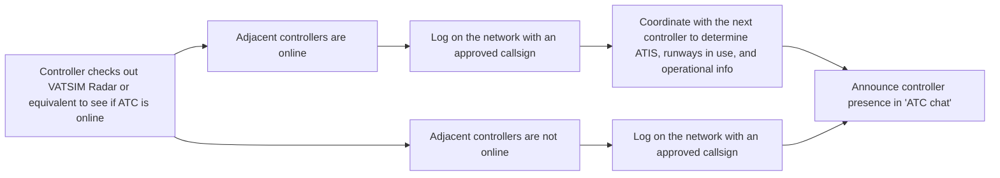

--8<-- "includes/abbreviations.md"

## Policy Information

### Control Information

|                     |                                                  |
| ------------------- | ------------------------------------------------ |
| Type                | Policy                                           |
| Revision            | R01/2025                                         |
| Effective Date      | 11 SEP 2025                                      |
| Prepared by         | Joshua Ong - ACCLEV3                             |
| Approved by         | Jordan Townsend - ACCLEV1                        |
| Next review date    | 08 MAR 2026                                      |
| Cancelled documents | Levant vACC ATS Policy for Home/Visiting Members |

### Record of Revisions

| Revision | Date        | Notes           | Author     |
| -------- | ----------- | --------------- | ---------- |
| R01/2025 | 11 SEP 2025 | Initial Release | Joshua Ong |

## General Provisions

### Scope

This document establishes the standard operating procedures for controllers operating in both their home and visiting capacities within the Levant vACC. The Levant vACC is responsible for providing, managing, and facilitating Air Traffic Control (ATC) services on the VATSIM network across the airspaces of **Iraq**, **Syria**, and **Lebanon**. These services are delivered in alignment with the vACC's core values of ensuring a high standard of realism, professionalism, and operational excellence.

The Levant vACC oversees air traffic controller operations within the **Baghdad FIR (ORBB)**, **Damascus FIR (OSTT)**, and **Beirut FIR (OLBB)**.

All VATSIM members are expected to comply with the VATSIM Code of Conduct and Code of Regulations, which govern behavior and operations across the network.

### Limitation of Liability

This document has been prepared for use on the VATSIM network only. It should never be used for real-world aviation operations. The authors of this document cannot be held liable for any personal injury and/or death from the misuse of this document.

## Controllers

### Conduct
Controllers in the Levant vACC must uphold professionalism and adhere to the following standards:

- **Adherence to VATSIM Regulations**  
  Controllers must comply with the VATSIM Code of Conduct and Code of Regulations.
- **Good Standing Requirement**  
  Controllers must remain in good standing with the Levant vACC, VATMENA, VATEMEA, and the VATSIM network.
- **Violation Consequences**  
  Controllers found violating the VATSIM Code of Conduct, regardless of role (controller, pilot, or observer), will be **immediately removed from the Levant vACC roster**. No prior notice will be given for such removal.
- **Compliance with Policies and Procedures**  
  Controllers must comply with all applicable Levant vACC standards, policies, and procedures, including:  
    - The Levant vACC Training System
    - SOPs (Standard Operating Procedures)
    - Operational Changes set by the ATS department
    - Letters of Agreement (LoAs)
- **Zero Tolerance for Misconduct**  
  Hate speech, violence, derogatory remarks, or personal attacks directed at pilots or fellow controllers will result in **immediate and permanent or temporary removal** from the Levant vACC, with further reporting to the VATSIM network.

Failure to comply with the conduct guidelines may lead to disciplinary action, including removal of controlling privileges.

### Training Standards
The Levant vACC strives to maintains a high standard of realism and excellence in ATC operations. 

- **Adherence to Official Procedures**  
  Controllers must follow the procedures outlined in:  
    - Published SOPs  
    - Operational Changes  
    - Letters of Agreement (LoAs)
- **Training Policy Compliance**  
  Controllers must adhere to:  
    - The Levant vACC Training Process for Home and Visiting Controllers  
    - The Levant vACC Activity Requirements Policy

Non-compliance may result in disciplinary action or restricted training and controlling privileges.

### Approved Positions
As we strive to maintain a high standard of realism and excellence in air traffic control operations within the vACC, only approved facilities and callsigns as listed below are permitted to be opened. While there are some restrictions on certain facilities and callsigns, the rest remain unrestricted.

#### List of Unrestricted Positions

##### Beirut FIR (OLBB)

| Name            | Login ID     |
| --------------- | ------------ |
| **Beirut ACC**  | **OLBB_CTR** |
| **Beirut TMA**  | **OLBA_APP** |
| **Beirut ADC**  | **OLBA_TWR** |
| **Beirut SMC**  | **OLBA_GND** |
| **Kleyate ADC** | **OLKA_TWR** |
| **Rayak ADC**   | **OLRA_TWR** |

##### Baghdad FIR (ORBB)

| Name                                                                       | Login ID       |
| -------------------------------------------------------------------------- | -------------- |
| **Baghdad ACC**                                                            | **ORBB_N_CTR** |
| **Baghdad UAC**                                                            | **ORBB_U_CTR** |
| Baghdad ACC :material-information-outline:{ title="Non-standard position"} | ORBB_S_CTR     |
| Baghdad UAC :material-information-outline:{ title="Non-standard position"} | ORBB_V_CTR     |
| Baghdad ACC :material-information-outline:{ title="Non-standard position"} | ORBB_W_CTR     |
| Baghdad ACC :material-information-outline:{ title="Non-standard position"} | ORBB_1_CTR     |
| Baghdad ACC :material-information-outline:{ title="Non-standard position"} | ORBB_2_CTR     |
| **Balad ADC**                                                              | **ORBD_TWR**   |
| **Baghdad TMA**                                                            | **ORBI_APP**   |
| Baghdad TMA :material-information-outline:{ title="Non-standard position"} | ORBI_DEP       |
| **Baghdad ADC**                                                            | **ORBI_TWR**   |
| **Baghdad SMC**                                                            | **ORBI_GND**   |
| **Mosul ADC**                                                              | **ORBM_TWR**   |
| **Mosul SMC**                                                              | **ORBM_GND**   |
| **Erbil ADC**                                                              | **ORER_TWR**   |
| **Embassy ADC**                                                            | **OREZ_TWR**   |
| **Kirkuk TMA**                                                             | **ORKK_APP**   |
| **Kirkuk ADC**                                                             | **ORKK_TWR**   |
| **Kirkuk SMC**                                                             | **ORKK_GND**   |
| **Ali TMA**                                                                | **ORMM_APP**   |
| **Basrah ADC**                                                             | **ORMM_TWR**   |
| **Basrah SMC**                                                             | **ORMM_GND**   |
| **Ali TMA**                                                                | **ORNI_APP**   |
| **Al-Najaf ADC**                                                           | **ORNI_TWR**   |
| **Al-Najaf SMC**                                                           | **ORNI_GND**   |
| **Q-West ADC**                                                             | **ORQW_TWR**   |
| **Sulaimaniyah ADC**                                                       | **ORSU_TWR**   |

##### Damascus FIR (OSTT)

| Name              | Login ID     |
| ----------------- | ------------ |
| **Damascus ACC**  | **OSTT_CTR** |
| **Aleppo TMA**    | **OSAP_APP** |
| **Aleppo ADC**    | **OSAP_TWR** |
| **Damascus TMA**  | **OSDI_APP** |
| **Damascus ADC**  | **OSDI_TWR** |
| **Damascus SMC**  | **OSDI_GND** |
| **Deir Zzor ADC** | **OSDZ_TWR** |
| **Kamishly ADC**  | **OSKL_TWR** |
| **Latakia TMA**   | **OSLK_APP** |
| **Latakia ADC**   | **OSLK_TWR** |

##### Non-Standard Administrative Positions

| Name                                                                                               | Login ID |
| -------------------------------------------------------------------------------------------------- | -------- |
| Baghdad FMP :material-information-outline:{ title="Non-standard position"} :octicons-checklist-24: | ORBI_FMP |
| Baghdad ACD :material-information-outline:{ title="Non-standard position"}                         | ORBI_DEL |
| Beirut FMP :material-information-outline:{ title="Non-standard position"} :octicons-checklist-24:  | OLBA_FMP |
| Beirut ACD :material-information-outline:{ title="Non-standard position"}                          | OLBA_DEL |
| Levant TMU :material-information-outline:{ title="Non-standard position"} :octicons-checklist-24:  | LEV_TMU  |

!!! abstract "Non-Standard Positions"
    :material-information-outline: Non-standard positions may only be used with prior authorization from the vACC ATS department.
    Approval must be sought from the **bolded parent** position prior to opening a Non-Standard Position, unless indicated otherwise (eg, for events).

    :octicons-checklist-24: Separate Flow endorsement is required for this position.

### Streaming

The Levant vACC welcomes all our controllers to stream their controlling sessions online in order to influence and show off the vACC.

- **Primary Duty**  
  Controllers who stream their sessions must **prioritize ATC duties** over stream interactions.
- **Voice Call**  
  Controllers intending to stream must:  
    - Notify fellow controllers in the **Discord coordination channel**  
    - Obtain consent from them before streaming in shared voice channels.

All controllers reserve the right to deny consent to any members. If consent is denied, the streaming controller will be required to move to a separate Discord call to avoid disrupting coordination.

### Minimum Connection Min

Controllers are required to meet the following session time requirements:

| Position | Minimum Session Time |
| -------- | -------------------- |
| DEL/GND  | 30 Minutes           |
| TWR      | 30 Minutes           |
| DEP/APP  | 30 Minutes           |
| CTR      | 30 Minutes           |

Sessions under 30 minutes will not be counted toward the controller's quarterly total. Repeated non-compliance may lead to disciplinary action.

### Commencing a Session

### Discord Presence

Though not mandated, for coordination purposes, controllers should present in the appropriate coordination channel on Discord to allow for smoother coordination. 

However during events, controllers are **MANDATED** to remain present in the appropriate coordination channel on Discord to allow for smoother coordination among adjacent controllers.

### Relief Callsigns

Controllers relieving others during peak hours or events must use a relief callsign (e.g. `ORBB_RN_CTR`) to ensure proper transition and avoid disruption.

### Ending a Session

Controllers must notify others of their intent to disconnect using the `.break` function on EuroScope and announce it on frequency at least 5 minutes before disconnecting.

---

## Controller Currency
This section sets the minimum activity requirement for resident and visiting controllers within the Levant vACC. It ensures that all controllers remain active and proficient by requiring them to log a minimum of **3 hours per calendar quarter**. Controllers who fail to meet this requirement will be considered inactive and removed from the roster, along with any associated training or waiting list status.

## Minimum Controller Activity
All resident and visiting controllers within the Levant vACC must log a minimum of **3 hours of ATC activity per calendar quarter** to remain active on the controller roster. 

Failure to meet this requirement will result in **automatic removal** from the roster and **any associated training plan or waiting list**.

The calendar quarters are defined as follows:

- **Quarter 1 (Q1) - 1st January to 31st March**
- **Quarter 2 (Q2) - 1st April to 30th June**
- **Quarter 3 (Q3) - 1st July to 30th September**
- **Quarter 4 (Q4) - 1st October to 31st December**

## Non-compliance with this Policy
Ignorance of policies is not an acceptable defense. It is each member’s responsibility to stay informed of the latest procedures. Repeated violations will result in the revocation of approvals.

